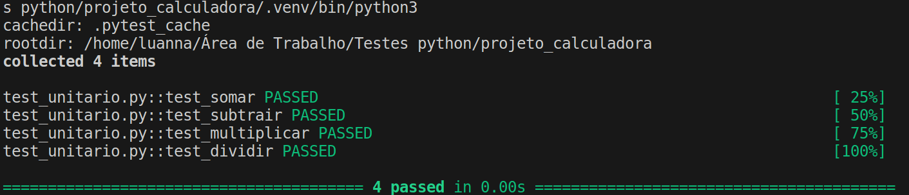

# testes_unitarios

## Estrutura do Projeto “projeto_calculadora”:
O projeto de testes unitários em Python foi organizado da seguinte forma:
projeto_calculadora/
      │
    • ├── calculadora.py
    • ├── test_calculadora.py
    • └── requirements.txt

Em que foram escritos testes unitários para cada função da calculadora.

Por boas práticas, a fim de facilitar a instalação das dependências do projeto, podemos listar as bibliotecas necessárias no arquivo requirements.txt.
    • Pytest

## Como Executar os Testes:
    1. Instale as dependências do projeto:
        pip install -r requirements.txt

    2. Execute os testes com o pytest:
        pytest

## Detalhes do Projeto Elaborado:
    • Testes Unitários: Os testes unitários foram escritos para cada função da calculadora, cobrindo diferentes cenários de entrada e verificando se o resultado é o esperado.
      
    • Organização do Projeto: O projeto está organizado em arquivos separados para a implementação da calculadora e os testes unitários, seguindo boas práticas de estrutura de projeto.
      
    • Dependências: As dependências do projeto estão listadas no arquivo requirements.txt, facilitando a instalação e replicação do ambiente de desenvolvimento.

## Saída teste automatizado usando o framework de testes Python:
    • Plataforma e Ambiente: O teste foi executado em um sistema Linux com Python 3.10.12, pytest-8.1.1 e pluggy-1.4.0.

    • Itens Coletados: O pytest coletou 4 itens de teste no arquivo "test_unitario.py".

    • Resultados dos Testes:
        ◦ O teste "test_somar" passou com sucesso.
        ◦ O teste "test_subtrair" passou com sucesso.
        ◦ O teste "test_multiplicar" passou com sucesso.
        ◦ O teste "test_dividir" passou com sucesso.

Essa saída mostra que todos os testes definidos no arquivo "test_unitario.py" passaram com sucesso. Isso é importante para garantir que as funções da calculadora estejam funcionando corretamente.